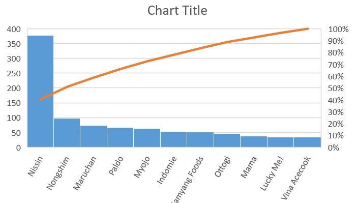

# map-reduce-lakkaraju
## DataSet:
Link : https://www.kaggle.com/residentmario/ramen-ratings

## About:
Broadly speaking, ramen is a bowl of wheat noodle soup made with a pungent broth and accompanied by various ingredients, added as toppings. The soup can be hot or cold, with meat and/or fish, or vegetarian, spicy, sweeter, and so on.

Here it display the brand and count of the brand . it shows based on the rating . 

## Powershell Command:
cat ramen-ratings.csv | python Ramenmapper.py | sort  | python Ramenreducer.py > lakkaraju-out.txt

## Chart:
## Number of count by brand
 